# DRIFTED

This is a readme file that contains the woking process of the work-in-progress game _DRIFTED_.

## Table of Contents

 > 1. [About the Project](#1-about-the-project)
 > 2. [Project Scope](#2-project-scope)
 > 3. [Scripts](#3-scripts)
 > 4. [Game Design](#4-game-design)

## 1. About the Project

### Sections

 > 1.1 [Links](#11-links)
 
 > 1.2 [Summary](#12-summary)

 > 1.3 [Gameplay Mechanics](#13-gameplay-mechanics)

### 1.1 Links

 - **Steam Page:** https://store.steampowered.com/app/2283820
 - **Facebook Page:** https://www.facebook.com/DriftedTheGame
 - **Press Kit:** https://huchi57.com/drifted

### 1.2 Summary

 - **Genre:** 3D side scroller
 - **Development Start Day:** December 12, 2023
 - **Engine:** Unity 2023.2.3.1f
 - **Programming Language:** C#
 - **Modeling:** Blender, ProBuilder
 - **Textures:** CC0 Public Domain Textures
 - **Sounds:** Assembled in FMOD Studio with sounds from Apple Loops library
 - **Fonts:** Noto family designed by Google, Avenir font series designed by Adrian Frutiger
 - **Platform:** Windows, Mac
 - **Steam Page Introduction**: DRIFTED (working title) is a 3D adventure platformer. You play as a paper airplane that ventures into an atmospheric and dystopian world. This game contains simple gameplay mechanics, minimal UI, and challenging puzzles.

 ### 1.3 Gameplay Mechanics

  - **Tilt Up:** Up key, W key, or controller up
  - **Tilt Down:** Down key, S key, or controller down

**[⬆ Back to Top](#table-of-contents)**

## 2. Project Scope

### Sections

 > 2.1 [Game Flowchart](#21-game-flowchart)
 
 > 2.2 [Project Structure](#22-project-structure)

### 2.1 Game Flowchart

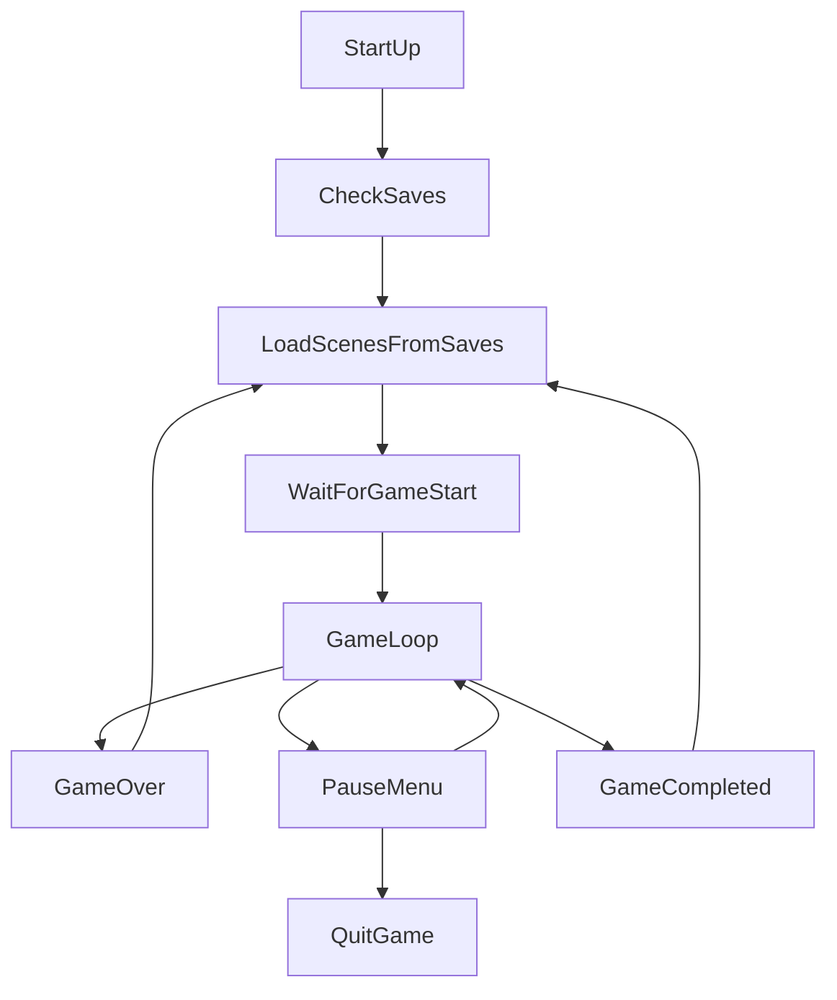

### 2.2 Project Structure

The Unity project asset folder is divided into four sections:

1. `_Core` folder consists of a custom package I created for all Unity projects I work on (*UrbanFox Core*)
2. `_PlaneGame` folder consists of scripts and all other assets created or imported for this project. With exceptions of resources and stream assets, every project-related asset should be added under this folder.
3. Reserved special folders like `Resources` and `StreamingAssets` contain files generated automatically or added by needs.
4. Other 3rd party files are imported to their original folder path. They are generally not modified and moved elsewhere.

The first two sections are the files I created or imported manually. Below is a more detailed hierarchy of the folder structure.

##### Project Asset Folder Structure
<pre>
_Core/
     Scripts/
        Editor/
            AttributeDrawers/
            CustomEditors/
            EditorWindows/
            Extensions/
            MenuItemTools/
            Utilities/
            [UrbanFox.Editor.asmdef]
        Runtime/
            Attributes/
            Components/
            Extensions/
            Localization/
            ScriptableObjects/
            Utilities/
            [UrbanFox.asmdef]
_PlaneGame/
    Materials/
    Models/
    Prefabs/
    Scenes/
    Scripts/
        Editor/
            CustomEditors/
            Utilities/
            [UrbanFox.MiniGame.Editor.asmdef]
        Runtime/
            AudioSystems/
            CameraSystems/
            GameFlow/
            Gameplay/
            Helpers/
            InputSystems/
            ScriptableObjects/
            UI/
            [UrbanFox.MiniGame.asmdef]
    ...
Plugins/
    ...
Resources/
    Languages/
        ...
    ...
StreamingAssets/
    ...
...
</pre>

**[⬆ Back to Top](#table-of-contents)**

## 3. Scripts

 > 3.1 [Core Scripts (Common Framework)](#31-core-scripts-common-framework)
 
 > 3.2 [Project Scripts](#32-project-scripts)

### 3.1 Core Scripts (Common Framework)

After many years of working with Unity, I have created my custom package, called *UrbanFox Core*, that contains common features and extension methods I use, both in editor and runtime, to boost my development speed on new projects. 

The scripts are saved under path `Assets/_Core/Scripts`. Here are some of the important features that I used for this game.

#### Extensions

##### MathExtensions

`MathExtensions` is a static extension class that contains common functions regarding math calculations. Here are the most commonly used functions in this project:

```csharp
// MathExtensions.cs

// Returns true if a value is in range, returns false if otherwise.
bool IsInRange(this float value, float rangeStart, float rangeEnd)

// Converts a euler angle into range [0, 360].
float Angle360(this float angle)

// Converts a euler angle into range [-180, 180].
float AnglePositiveOrNegative180(this float angle)
```

##### CollectionExtensions

`CollectionExtensions` is a static extension class that contains common operations on data types that implement the `ICollection` interface. Here are the most commonly used functions in this project:

```csharp
// CollectionExtensions.cs

// Returns true if the collection is null or has 0 items, returns false if otherwise.
bool IsNullOrEmpty<T>(this ICollection<T> collection)

// Returns true if an index is in range [0, collection.Count - 1].
bool IsInRange<T>(this int index, ICollection<T> collection)

// Returns a random item from a collection.
T SelectRandom(this ICollection<T> collection)
```

#### Localization System

Building the localization from ground up, I had created a simple tool that can download language data from Google Spreadsheet, so the texts can be reviewed easily by testers and reviewers without needing the Editor installed. Localization data is downloaded, parsed, and saved in the project in these steps:


1. Download the data of the spreadsheet row by row. The number of columns determines how many sets of language data we need.

2. From the second row and so on, each row is written into individual language sets using a key-value pair.

3. When the data parsing is finished throughout the whole sheet, the data is written into XML files, and saved into the Resource folder. 

In game, simply call `TryGetLocalization()` of a string and it will return a correct localized value, or an error value if a key is not found.

```csharp
// Localization.cs

// An event callback that will be invoked whenever the game language changes.
public static event Action OnLanguageChanged

// Returns true if a key can be localized, returns false if otherwise. Use output string value as the localization result.
public static bool TryGetLocalization(this string key, out string value)

// Sets the current language of the game.
public static void SetLanguage(string languageName)
```

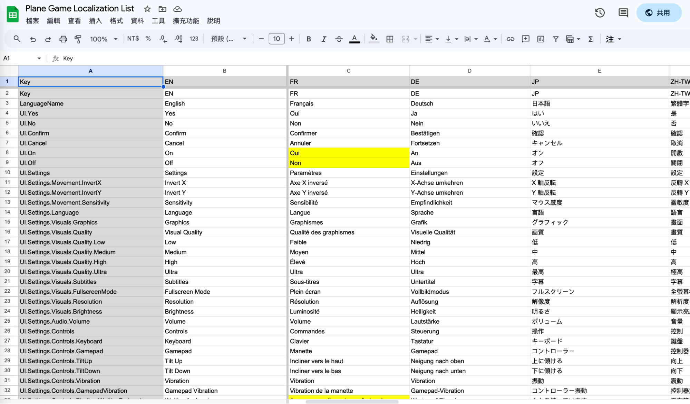

*Localization Table on Google Spreadsheets*

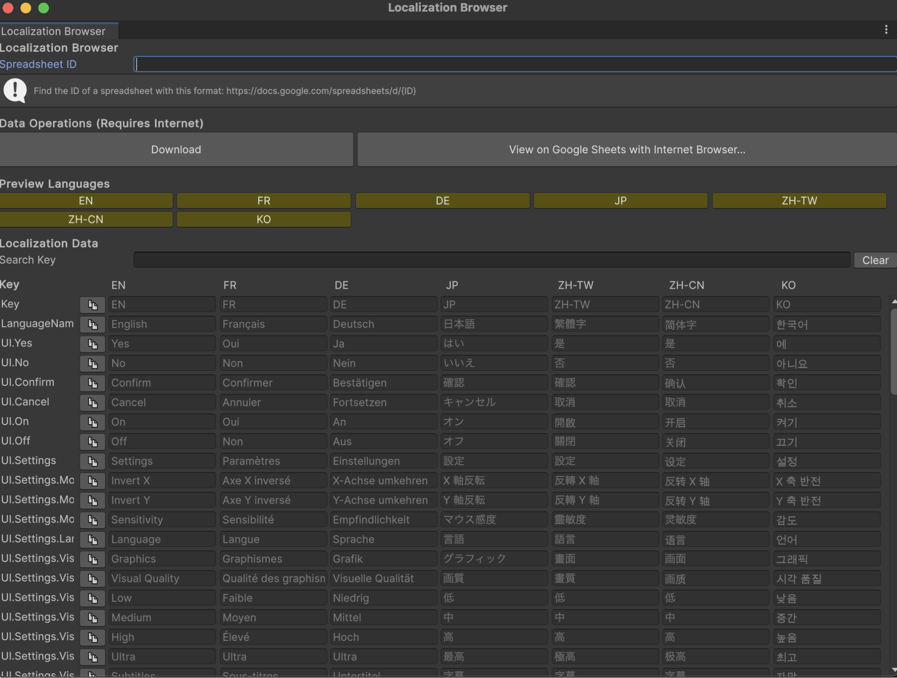

*Localization Table in Unity Editor, supporting multiple language, custom language codes, and searches.*

#### Scene Manager

My custom scene manager extends Unity's built-in `SceneManager`, and further supports loading and unloading multiple scenes at once.

These load and unload functions also support additional callbacks to be invoked when operations are completed, or when the progress is being updated, which can be useful if we need the current percentage of the loading process for UI items like a loading bar.

These functions also come with single-scene equivalents, and coroutine alternatives.

```csharp
// FoxySceneManager.cs

// Loads a list of scenes in the background, with optional callbacks
public static void LoadScenes(IEnumerable<string> scenes, Action onComplete = null, Action<float> onProgress = null)

// Unloads a list of scenes in the background, with optional callbacks
public static void UnloadScenes(IEnumerable<string> scenes, Action onComplete = null, Action<float> onProgress = null)
```

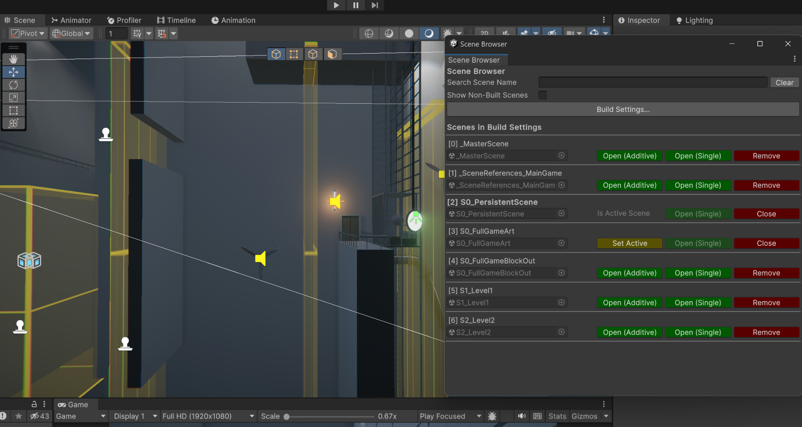

*A preview of the scene browser.*

#### Custom Attributes

Multiple attributes are implemented to help clean up Editor windows for more clear data displays, highlight references that must not be null, and hide or disable unnecessary data fields according to different conditions. Some attributes include `ShowIf`, `EnableIf`, `ShowIfNot`, `EnableIfNot`, `Indent`, `Required`, and `NonEditable`.

Below is an example usage of the ShowIf attribute that is used in this project:

```csharp
// ObjectSpawner.cs

[SerializeField]
private bool m_randomizeRotation;

[SerializeField, Indent, ShowIf(nameof(m_randomizeRotation), true)]
private float m_eulerAngleXMin;

[SerializeField, Indent, ShowIf(nameof(m_randomizeRotation), true)]
private float m_eulerAngleXMax;

[SerializeField, Indent, ShowIf(nameof(m_randomizeRotation), true)]
private float m_eulerAngleYMin;

[SerializeField, Indent, ShowIf(nameof(m_randomizeRotation), true)]
private float m_eulerAngleYMax;

[SerializeField, Indent, ShowIf(nameof(m_randomizeRotation), true)]
private float m_eulerAngleZMin;

[SerializeField, Indent, ShowIf(nameof(m_randomizeRotation), true)]
private float m_eulerAngleZMax;
```

|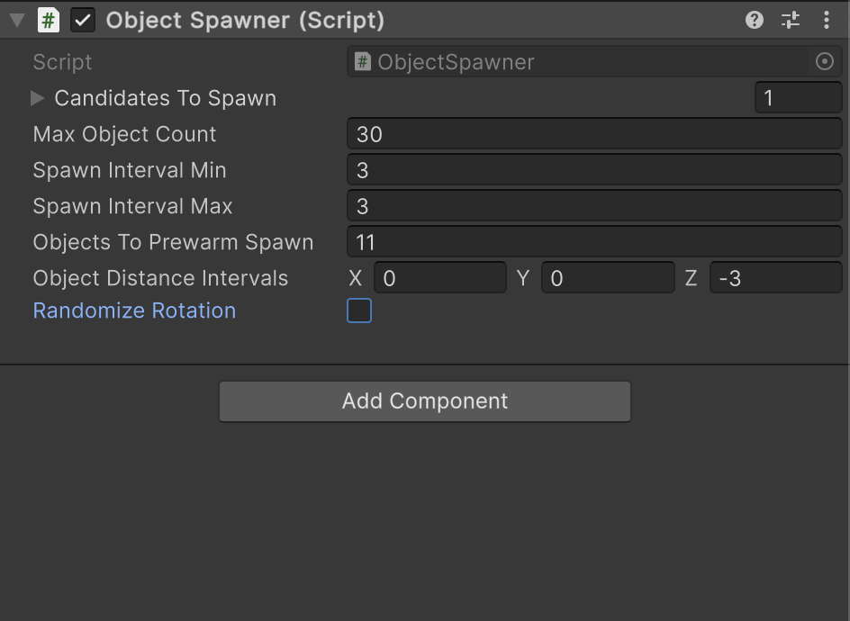|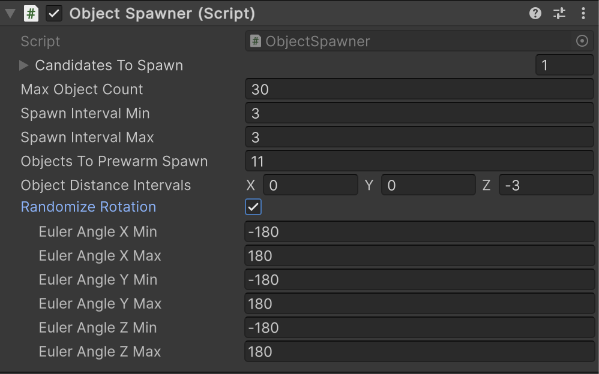|
|-------------------------------|-------------------------------|
|*Inspector view: When `ShowIf` returns `false`.* | *Inspector view: When `ShowIf` returns `true`.* |

#### Color Palette Generator

This is a tool to generate a 16-color color palette texture on a 4x4 grid. The colors can be manually set, or automatically fetched from an image texture by dividing the image into grids and calculating the average color on each grid.

This tool is extra usefull in this project since most of the meshes in the game share a same master material, by changing the UV of different faces, most of the meshes can be batched into the same drawcall, reducing rendering time.

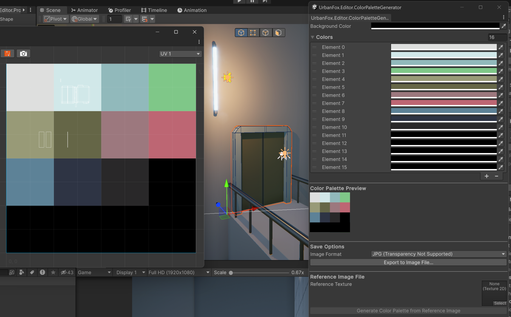

*A preview of the color palette generator.*

### 3.2 Project Scripts

#### Gameplay Framework

- The `GameManager` is a singleton component that holds all events that can be added and removed by all other systems in the game that will be invoked according to different game states. It also contains scene loading logics, global access to game state, and the player reference. 

- The `SettingsManager` is a singleton component that reads/writes settings data to file.

- The `InputManager` is a singleton component that handles user inputs. It extends Unity's InputSystem with a custom and simple implementation that exposes only necessary functions for this project.

- The `AudioManager` is a singleton component that contains references to audio buses and controls the global and in game audio fade-ins and fade-outs.

- The `UIManager` is a singleton component that handles all UI in the game, including pause menu, splash screens, full screen fade in and fade out, and so on.

#### Player Controller

The `PlayerController` is the essence of the gameplay. For maximum control, built-in physics are usually disabled. Instead, a custom set of rules are defined:

- The component reads up and down inputs from the player, and using the provided input values, tilt up or down the paper airplane.
- When no input is provided, the plane will gradually tilt downwards until it reaches a terminal velocity as if it is pulled by gravity.
- The acceleration is defined by current velocity, current pitch angle, and by a limit threshold.
- When the plane tilts up for an excessive number of seconds, it will temporarily block any upward inputs, making the plane tilt downwards gradually.
- If the plane receives a game over signal, for example, if it hits any obstacles or is caught in a `WindTrigger`, user inputs are ignored, and the built-in physics take over the control, for simulating real physics, until the plane resets to its checkpoint position.

#### Camera System

Inspired by Unity's Cinemachine system, I created my own implementation of camera works from ground up, using handles to preview buttons to visualize different anchor reference points for the relative distance between the player and the camera.

Each anchor point contains different data, and using inverse distance weighting, weight-averaged values and current camera data, the data of the next frame is calculated in the `CameraBrain` component, which contains a reference to the actual camera in the game.

> **Inverse Distance Weighting**
>
> $$z_p = \frac{\sum_(\frac{z_i}{d_i^p})}{\sum_(\frac{1}{d_i^p})}$$
> 
> for given $z$ value and $d$ distance on each point indexed $i$.

Here is the struct definition of a point data, that is, the $z$ values to be calculated:

```csharp
// CameraContributorPointData.cs

public struct CameraContributorPointData
{
    // Default values if parameters not given
    public const float DefaultPositionLerpSpeed = 5;
    public const float DefaultRotationSlerpSpeed = 5;
    public const float DefaultFOV = 60;
    public const float DefaultFOVLerpSpeed = 5;

    // Reference point of the data in the world
    public Vector3 ReferencePoint;

    // Position effector
    public Vector3 DistanceFromTargetToCamera;
    public Vector3 PositionOffsetAfterLookAt;
    public float PositionLerpSpeed;

    // Rotation effector
    public Vector3 LookAtOffsetDistanceFromTarget;
    public float RotationSlerpSpeed;
    public float FOV;
    public float FOVLerpSpeed;
}
```

For each frame, `CameraBrain` calculates which contributor has the highest priority, and by given player position and the contributor's reference point, a target result is calculated, and the camera will interpolate to that target from the calculated results.

Camera contributors are added/removed by following functions:

```csharp
// CameraBrain.cs

// Add contributor to the calculation (when player enters the zone)
public void AddContributor(CameraContributorBase contributor)

// Remove contributor from the calcuiation (when player leaves the zone)
public void RemoveContributor(CameraContributorBase contributor)

// Clear all contributors (when game is being restarted)
public void ClearAllContributors()
```

#### UI System

A `UIPage` is the base element for displaying a group of UI elements that is accessed by `UIPageGroup`. A `UIPage` can be opened, closed, saved in history stacks, that remembers what is the last visited page, if the group is closed entirely.

```csharp
// UIPageGroup.cs

// Open the group, and go to default first page, or cached page in the top stack of the page history
public void OpenPageGroup(Action onCompleted = null)

// Closes the page group
public void ClosePageGroup(Action onCompleted = null)

// Close current opened page, saved into the history stack, and go to a target page
public void GotoPage(UIPage page)

// Close current opened page, pop the top of the history stack and open it, or close the page group entierly if the history is empty
public void TryGotoPreviousPage()
```

#### Other Gameplay Elements

##### Spinner

The spinners in the game not only spin objects, but they also create runtime copies of the targeted mesh, and reduce their transparencies gradually, to create an effect that looks like motion blur is applied. The reason why this effect is used, instead of post-processing, is because we only want the spinning objects to have the motion blur effect, rather than the full screen.

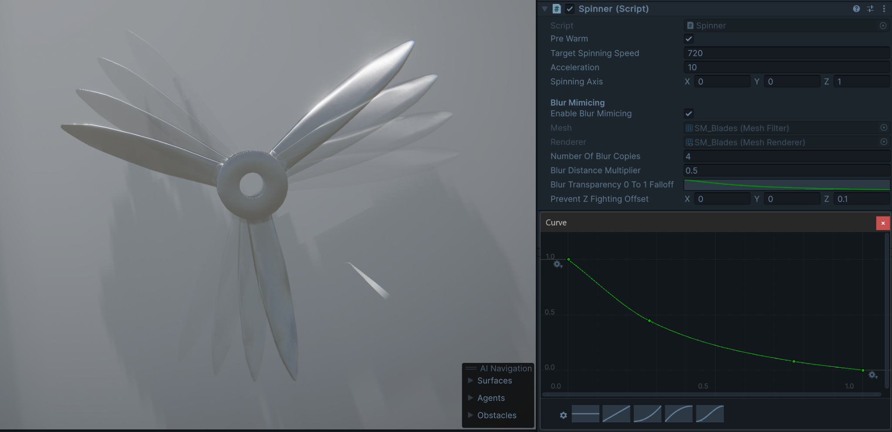

*A preview of the spinner's Inspector view.*

##### Path Finding Patrol

There are patrol drones that will follow a pre-defined route when it does not detect the player. This route is consist of pre-placed points, which then defines a cubic or quadratic bezier curve.

The cubic or quadratic option can be decided in the Inspector panel. Either way the path can be pre-visualized in the editor.

> **Quadratic Bezier Curve**
>
> $\mathbf{B}(t)=(1-t)^2\mathbf{P_0}+2(1-t)t\mathbf{P_1}+t^2\mathbf{P_2},0\leq t\leq 1.$


> **Cubic Bezier Curve**
>
> $\mathbf{B}(t)=(1-t)^3\mathbf{P_0}+3(1-t)^2t\mathbf{P_1}+3(1-t)t^2\mathbf{P_2}+t^3\mathbf{P_3},0\leq t\leq 1.$

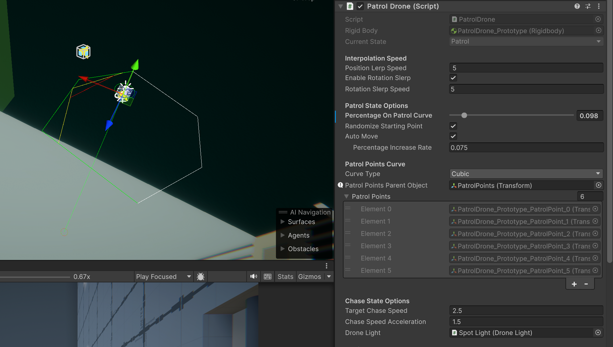

*A preview of the patrol drone's Inspector view.*

##### ConveyorBelt

The conveyor belts in the game are all static meshes. They apply forces to objects above them, and the UV scrolling effect is used to make the belts look like they are scrolling.

**[⬆ Back to Top](#table-of-contents)**

## 4. Game Design

### Sections

 > 4.1 [Level Design](#41-level-design)

 > 4.2 [Lighting](#42-lighting)

 > 4.3 [Audio](#43-audio)

### 4.1 Level Design

The early prototyping of the game took about one week, including tweaking player movements, and testing blockouts for different types of levels and obstacles. All objects in the project use the player paper plane as a reference, to create a world that looks vast and lonely. Because of the mechanics, the level is gradually descending in altitude as the game progresses, giving the sense of going darker and deeper into this world.

|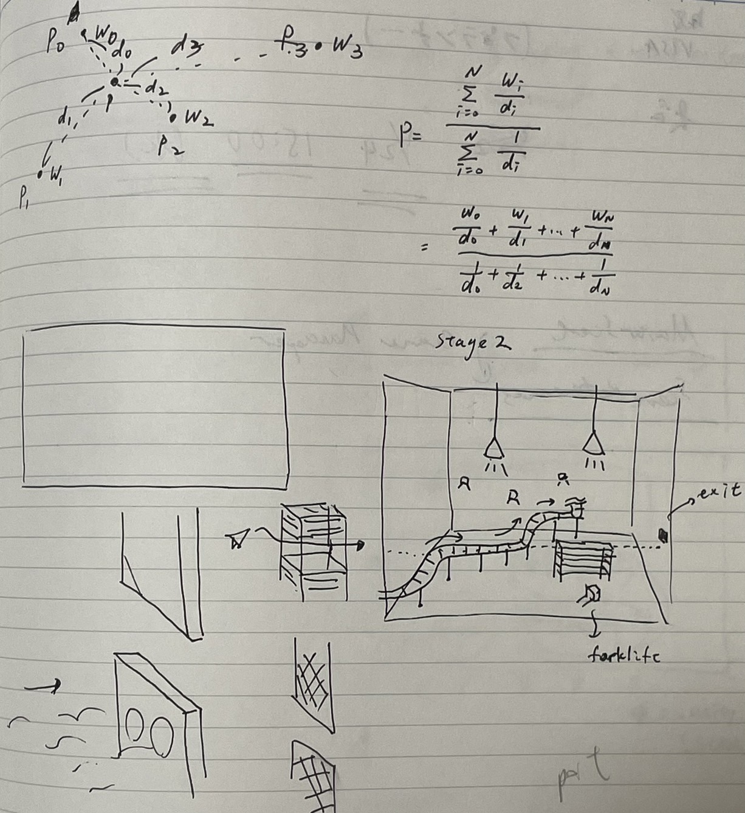|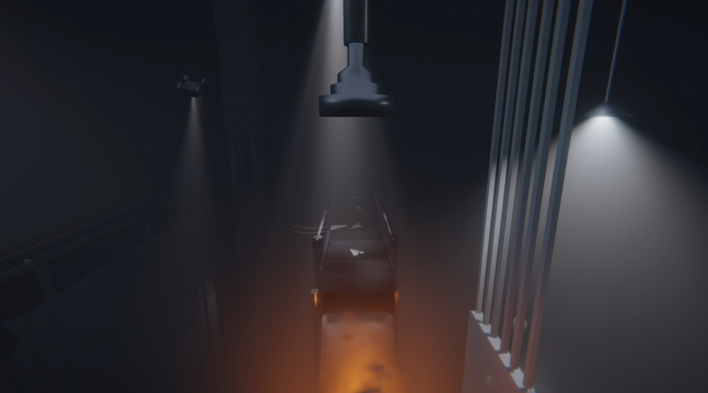|
|-------------------------------|-------------------------------|
|*Original sketch of a level.* |*The same level in the game.* |

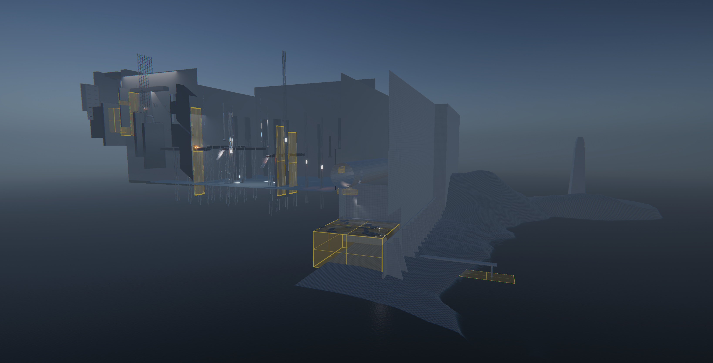

*Current full game layout (without post-processing effects).*

### 4.2 Lighting

This project utilized Unity's HDRP (High Definition Render Pipeline) for rendering features like water, realtime area lights, fog, and volumetric lights.

Fogs and volumetric lights play essential roles for the atmosphere building for this game. They are awesome blockouts for occluding environments in the background, but they also create great details in making the scene with beautiful depth without placing many props.


*The ocean in the game is rendered by Unity's water renderer and foam generator.*

### 4.3 Audio

This project uses FMOD as the middleware for audio, and Apple Loop audio files as audio assets. Sounds are created and defined as "events" in FMOD Studio. Each event can include different tracks and audio files, loop regions, instrument variations, and effects and modulations like EQ, reverb, and random pitch. Events are played/paused/stopped in Unity in real time, and can have different effects by tweaking exposed parameters in the game. When designing sounds for this project, different areas have different reverb zone snapshots, creating different sound effects that emulate real world audio zones.

Buses are groups that audio events are sent to. Effects can be applied on groups to affect all events that are sent to this bus, or the signals can be sent to other groups. There are different buses in the game that control individual types of sound events.

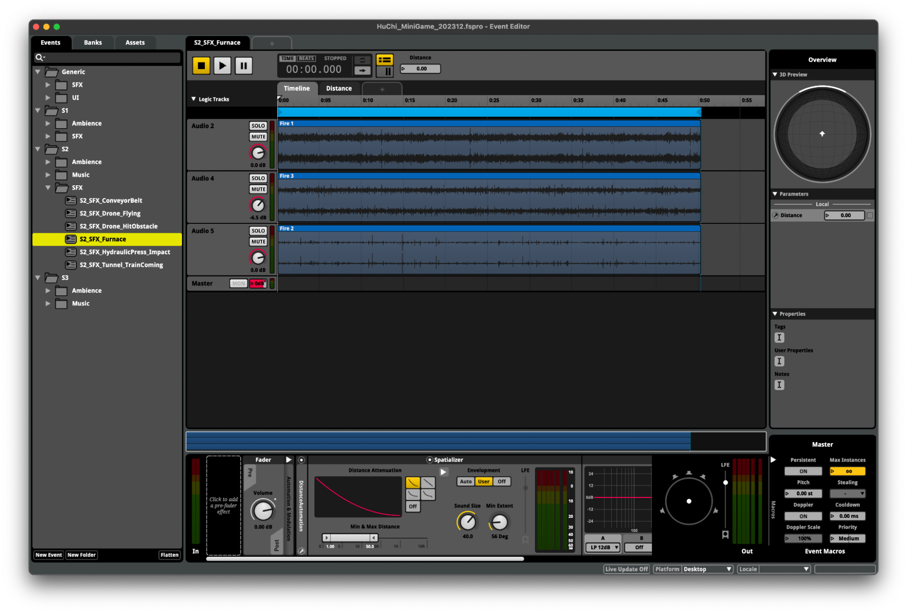

*A screenshot of the FMOD Studio.*

**[⬆ Back to Top](#table-of-contents)**
