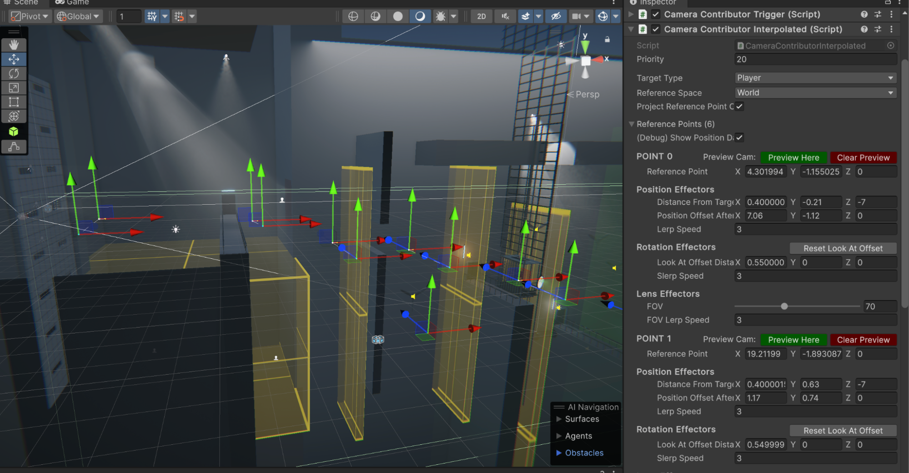
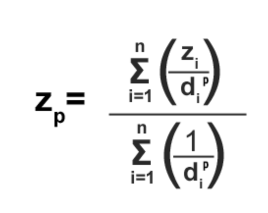

# PlaneGame

日本語はこちら。

---

## Menu

- [Project Overview](#project-overview)
- [Gameplay Mechanics](#gameplay-mechanics)
- [Game Flowchart](#gameplay-flowchart)
- [Project Scope](#project-scope)
- [Script Hierarchy](#script-hierarchy)
  - [Core Scripts (Common Scripts)](#core-scripts-common-scripts)
  - [Localization](#localization)
  - [LightFlicker](#lightflicker)
  - [Extensions](#extensions)
    - [MathExtensions](#mathextensions)
    - [CollectionExtensionts](#collectionextensions)
  - [Attributes](#attributes)
- [Project Scripts](#project-scripts)
  - [Gameplay](#gameplay)
    - [PlayerController](#playercontroller)
    - [ConveyorBelt](#conveyorbelt)
    - [Spinner](#spinner)
  - [Camera Systems](#camera-systems)
  - [UI](#ui)
    - [UIPage & UIPageGroup](#uipage--uipagegroup)
- [Creating Levels](#creating-levels)
  - [Level Design](#level-design)
  - [Lighting](#lighting)
  - [Audio](#audio)

---

## [Project Overview](#menu)

- **Genre:** 3D side scroller
- **Development Start Day:** December 12, 2023
- **Engine:** Unity 2023.2.3.1f
- **Programming Language:** C#
- **Modeling:** Blender (paper plane and propeller) and ProBuilder (anything else)
- **Textures:** CC0 Public Domain Textures
- **Sounds:** Assembled in FMOD Studio with sounds from Apple Loops library
- **Fonts:** Noto family designed by Google, Avenir font series designed by Adrian Frutiger
- **Platform:** Windows & Mac

## [Gameplay Mechanics](#menu)

- **Up Key:** Tilt up
- **Down Key:** Tilt down

## [Game Flowchart](#menu)


The game loads if a settings file exists, and if it does, load the configuration to the application. Otherwise, default values will be created, and written to the settings file.
The main game's title screen is integrated with the beginning of the game, so the game scene is loaded after the splashscreen. During the gameplay, there is no UI unless the game is paused, showing the pause menu.

If there is a game over, the game will restart from the latest checkpoint through fade-outs and fade-ins. If the game is fully completed, an ending credits will be played, and after that, pressing any key will reload the game back to the beginning.
Through the pause menu, the player can resume, quit the game, and change various settings that include visual settings, volume, and language. For the demo and testers, there are also bug reports and questionnaire links accessible from this pause menu.

## [Project Scope](#menu)

- The `GameManager` is a singleton component that holds all events that can be added and removed by all other systems in the game that will be invoked according to different game states. It also contains scene loading logics, global access to game state, and the player reference. 

- The `SettingsManager` is a singleton component that reads/writes settings data to file.

- The `InputManager` is a singleton component that handles user inputs. It extends Unity's InputSystem with a custom and simple implementation that exposes only necessary functions for this project.

- The `AudioManager` is a singleton component that contains references to audio buses and controls the global and in game audio fade-ins and fade-outs.

- The `CameraBrain` is the global access to the camera component of the game. It contains a list of different 

- `CameraContributorPointData` instances calculate the position where the camera should be at each frame, depending on the data with the highest priority, player position, and the current delta values of the camera, including position, rotation, and field of view.

- The `PlayerController` is a component that handles mainly the movements of the player. It uses custom math calculation for simulating paper physics of a flying paper plane. Upon game overs (i.e. player loses control), custom physics are replaced with Unity's built-in gravity for realistic falling effects. The `PlayerController` holds a reference to the `Rigidbody`. A detailed explanation of the `PlayerController` is documented in later sections.

- `UIPageGroup` is a type of UI component that controls browsing different `UIPage` components. Visited pages are saved in a history Stack. The only UIPageGroup implemented for this project is the UIController, which controls the pause menu of the game.

---

## [Script Hierarchy](#menu)

### [Core Scripts (Common Scripts)](#menu)

After many years of working with Unity, I have created my custom packages that contain common features and extension methods I use, both in editor and runtime, to boost my development speed on new projects. Here are some of the common features that I used for this game.

### [Localization](#menu)


Building the localization from ground up, I had created a simple tool that can download language data from Google Spreadsheet, so the texts can be reviewed easily by testers and reviewers without needing the Editor installed. Localization data is downloaded, parsed, and saved in the project in these steps:

1. Download the data of the spreadsheet row by row. The number of columns determines how many sets of language data we need.

2. From the second row and so on, each row is written into individual language sets using a key-value pair.

3. When the data parsing is finished throughout the whole sheet, the data is written into XML files, and saved into the Resource folder. 


### [LightFlicker](#menu)

A component to make Unity's light component flicker by a sequence of alphabets. This way of implementing flickering lights is inspired by Valve, which is used in their games like Quake and Half-Life series. Flickering pattern can be provided with custom strings, or from a set of predefined values.

### [Extensions](#menu)

#### [MathExtensions](#menu)

`MathExtensions` is a static extension class that contains common functions regarding math calculations. Here are the most commonly used functions in this project.

```
bool IsInRange(this float value, float rangeStart, float rangeEnd)
float Angle360(this float angle)
float AnglePositiveOrNegative180(this float angle)
```

#### [CollectionExtensions](#menu)

`CollectionExtensions` is a static extension class that contains common operations on data types that implement the ICollection interface. Here are the most commonly used functions in this project.

```
bool IsNullOrEmpty<T>(this ICollection<T> collection)
bool IsInRange<T>(this int index, ICollection<T> collection)
T SelectRandom(this ICollection<T> collection)
```

### [Attributes](#menu)

Multiple attributes are implemented to help clean up Editor windows for more clear data displays, highlight references that must not be null, and hide or disable unnecessary data fields according to different conditions. Some attributes include `ShowIf`, `EnableIf`, `ShowIfNot`, `EnableIfNot`, `Indent`, `Required`, and `NonEditable`.

Below is an example usage of the ShowIf attribute that is used in this project.

```
[ShowIf(nameof(m_randomizeRotation), true)]
private m_eulerAngleXMin;
```


*When `ShowIf` returns false*


*When `ShowIf` returns true*

---

## [Project Scripts](#menu)

### [Gameplay](#menu)

#### [PlayerController](#menu)

The `PlayerController` is the essence of the gameplay. For maximum control, built-in physics are usually disabled. Instead, a custom set of rules are defined:

- The component reads up and down inputs from the player, and using the provided input values, tilt up or down the paper airplane.
- When no input is provided, the plane will gradually tilt downwards until it reaches a terminal velocity as if it is pulled by gravity.
- The acceleration is defined by current velocity, current pitch angle, and by a limit threshold.
- When the plane tilts up for an excessive number of seconds, it will temporarily block any upward inputs, making the plane tilt downwards gradually.
- If the plane receives a game over signal, for example, if it hits any obstacles or is caught in a `WindTrigger`, user inputs are ignored, and the built-in physics take over the control, for simulating real physics, until the plane resets to its checkpoint position.

#### [ConveyorBelt](#menu)

The conveyor belts in the game are all static meshes. They apply forces to objects above them, and the UV scrolling effect is used to make the belts look like they are scrolling.

#### [Spinner](#menu)

The spinners in the game not only spin objects, but they also create runtime copies of the targeted mesh, and reduce their transparencies gradually, to create an effect that looks like motion blur is applied. The reason why this effect is used, instead of post-processing, is because we only want the spinning objects to have the motion blur effect, rather than the full screen.

### [Camera Systems](#menu)



Inspired by Unity's Cinemachine system, I created my own implementation of camera works from ground up, using handles to preview buttons to visualize different anchor reference points for the relative distance between the player and the camera. Each anchor point contains different data, and using inverse distance weighting, weight-averaged values and current camera data, the data of the next frame is calculated in the `CameraBrain` component, which contains a reference to the actual camera in the game.



`z = value, d = distance`

Here is the struct definition of a point data:

```
public struct CameraContributorPointData
{
    public const float DefaultPositionLerpSpeed = 5;
    public const float DefaultRotationSlerpSpeed = 5;
    public const float DefaultFOV = 60;
    public const float DefaultFOVLerpSpeed = 5;
    public Vector3 ReferencePoint;
    // Position Effector
    public Vector3 DistanceFromTargetToCamera;
    public Vector3 PositionOffsetAfterLookAt;
    public float PositionLerpSpeed;
    // Rotation Effector
    public Vector3 LookAtOffsetDistanceFromTarget;
    public float RotationSlerpSpeed;
    public float FOV;
    public float FOVLerpSpeed;
}
```

### [UI](#menu)

#### [UIPage & UIPageGroup](#menu)

A `UIPage` is the base element for displaying a group of UI elements that is accessed by `UIPageGroup`. A `UIPage` can be opened, closed, saved in history stacks, that remembers what is the last visited page, if the group is closed entirely.

#### [UILocalizedText](#menu)

A `UILocalizedText` contains a reference to the Text component, and a key that will be localized in runtime to the current language.

---

## [Creating Levels](#menu)

### [Level Design](#menu)

The prototyping of the game took about one week, including tweaking player movements, and testing blockouts for different types of levels and obstacles. All objects in the project use the player paper plane as a reference, to create a world that looks vast and lonely. Because of the mechanics, the level is gradually descending in altitude as the game progresses, giving the sense of going darker and deeper into this world.

### [Lighting](#menu)

This project utilized Unity's HDRP (High Definition Render Pipeline) for rendering features like water, realtime area lights, fog, and volumetric lights.

Fogs and volumetric lights play essential roles for the atmosphere building for this game. They are awesome blockouts for occluding environments in the background, but they also create great details in making the scene with beautiful depth without placing many props.

### [Audio](#menu)


This project uses FMOD as the middleware for audio, and Apple Loop audio files as audio assets. Sounds are created and defined as "events" in FMOD Studio. Each event can include different tracks and audio files, loop regions, instrument variations, and effects and modulations like EQ, reverb, and random pitch. Events are played/paused/stopped in Unity in real time, and can have different effects by tweaking exposed parameters in the game. When designing sounds for this project, different areas have different reverb zone snapshots, creating different sound effects that emulate real world audio zones.

Buses are groups that audio events are sent to. Effects can be applied on groups to affect all events that are sent to this bus, or the signals can be sent to other groups. There are different buses in the game that control individual types of sound events.
