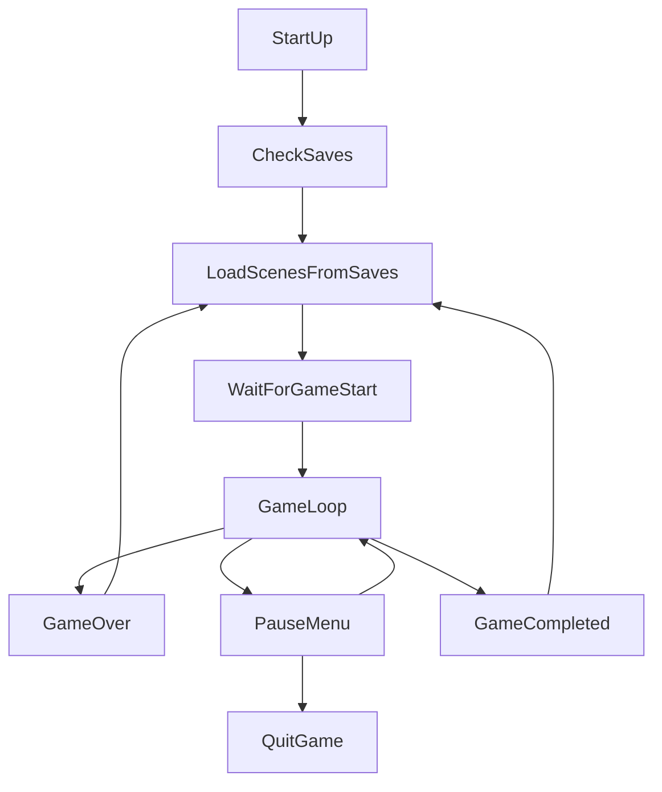
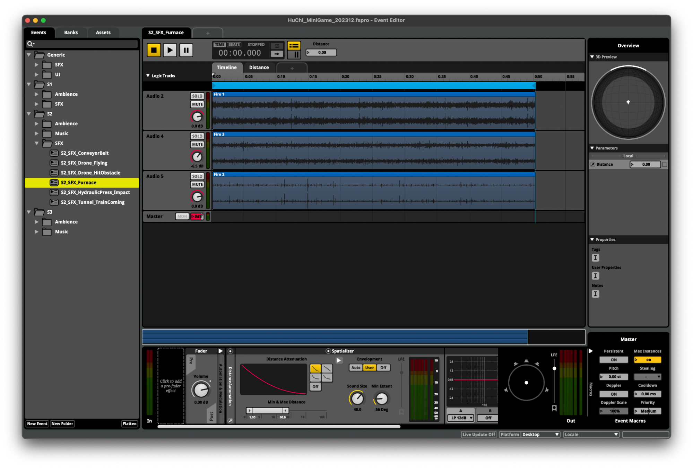

# DRIFTED
これは、開発中のゲーム DRIFTED（従来のタイトル：PlaneGame）の作業プロセスを含む Readme ファイルです。

### [Click here for the English version.](README.md)

## 目次
 > 1. [プロジェクト概要](#1-プロジェクト概要)
 > 2. [プロジェクトスコープ](#2-プロジェクトスコープ)
 > 3. [スクリプト](#3-スクリプト)
 > 4. [ゲームデザイン](#4-ゲームデザイン)

## 1. プロジェクト概要

### セクション

 > 1.1 [リンク](#11-リンク)

 > 1.2 [概要](#12-概要)

 > 1.3 [ゲームプレイメカニクス](#13-ゲームプレイメカニクス)

#### 1.1 リンク
 - **Steam ページ:** https://store.steampowered.com/app/2283820
 - **Facebook ページ:** https://www.facebook.com/DriftedTheGame
 - **プレスキット:** https://huchi57.com/drifted

#### 1.2 概要
 - **ジャンル:** 3D 横スクロールアクション
 - **開発開始日:** 2023年12月12日
 - **エンジン:** Unity 2023.2.3.1f
 - **プログラミング言語:** C#
 - **モデリング:** Blender、ProBuilder
 - **テクスチャ:** CC0 Public Domain Textures
 - **サウンド:** Apple Loops ライブラリからの音を使用して FMOD Studio で組み立て
 - **フォント:** Google によって設計された Noto ファミリー、Adrian Frutiger によって設計された Avenir フォントシリーズ
 - **プラットフォーム:** Windows、Mac
 - **Steam ページ紹介:** DRIFTED（仮題）はパズルプラットフォーマーアドベンチャーゲームである。プレイヤーキャラクターは紙飛行機で、暗くてディストピアの世界を冒険する。

### 1.3 ゲームプレイメカニクス
 - **上に傾ける:** 上キー、W キー、またはコントローラーの上
 - **下に傾ける:** 下キー、S キー、またはコントローラーの下

**[⬆ 目次に戻る](#目次)**

## 2. プロジェクトスコープ

### セクション

 > 2.1 [ゲームフローチャート](#21-ゲームフローチャート)

 > 2.2 [プロジェクトの構造](#22-プロジェクトの構造)
 
 ### 2.1 ゲームフローチャート



## 2.2 プロジェクトの構造

Unity プロジェクトの Asset フォルダーは、次の四つのセクションに分かれています：

1. `_Core` フォルダーは、自分で作業しているすべての Unity プロジェクトに使用する共通カスタムパッケージ *UrbanFox Core* で構成されています。
2. `_PlaneGame` フォルダーには、このプロジェクトのために作成されたスクリプトやその他のアセットが含まれています。`Resources` や `StreamingAssets` を除き、プロジェクトに関連するすべてのアセットはこのフォルダーの中で追加します。
3. `Resources` や `StreamingAssets` などの特殊なフォルダーには、自動的に生成されるファイルや必要に応じて追加されるファイルが含まれています。
4. サードパーティーファイルは、それらの元のフォルダーパスにインポートされます。通常、これらは変更されず、他の場所にも移動されません。

最初の二つのセクションは、手動で作成またはインポートしたファイルです。以下は、フォルダー構造のより詳細な構造です。

##### プロジェクトの Asset フォルダーの構造
<pre>
_Core/
     Scripts/
        Editor/
            AttributeDrawers/
            CustomEditors/
            EditorWindows/
            Extensions/
            MenuItemTools/
            Utilities/
            [UrbanFox.Editor.asmdef]
        Runtime/
            Attributes/
            Components/
            Extensions/
            Localization/
            ScriptableObjects/
            Utilities/
            [UrbanFox.asmdef]
_PlaneGame/
    Materials/
    Models/
    Prefabs/
    Scenes/
    Scripts/
        Editor/
            CustomEditors/
            Utilities/
            [UrbanFox.MiniGame.Editor.asmdef]
        Runtime/
            AudioSystems/
            CameraSystems/
            GameFlow/
            Gameplay/
            Helpers/
            InputSystems/
            ScriptableObjects/
            UI/
            [UrbanFox.MiniGame.asmdef]
    ...
Plugins/
    ...
Resources/
    Languages/
        ...
    ...
StreamingAssets/
    ...
...
</pre>

**[⬆ 目次に戻る](#目次)**

## 3. スクリプト

 > 3.1 [共通スクリプト](#31-共通スクリプト)
 
 > 3.2 [プロジェクトスクリプト](#32-プロジェクトスクリプト)

### 3.1 共通スクリプト

自分で Unity を長年使用の経験で、開発スピードを向上させるために、共通の機能や拡張メソッドが含まれたカスタムパッケージ *UrbanFox Core* を作成しました。

これらのスクリプトは、`Assets/_Core/Scripts` の下に保存されています。このゲームで使用したいくつかの重要な機能は以下の通りです。

#### 拡張メソッド

##### MathExtensions

`MathExtensions` は、数学計算に関する一般的な機能を含む静的クラスです。このプロジェクトで最もよく使用される関数は次の通りです：

```csharp
// MathExtensions.cs

// 値が範囲内にある場合は true を返し、それ以外の場合は false を返します。
bool IsInRange(this float value, float rangeStart, float rangeEnd)

// オイラー角を範囲 [0, 360] に変換します。
float Angle360(this float angle)

// オイラー角を範囲 [-180, 180] に変換します。
float AnglePositiveOrNegative180(this float angle)
```

##### CollectionExtensions

`CollectionExtensions` は、`ICollection` インターフェースを実装するデータ型に対する一般的な操作を含む静的クラスです。このプロジェクトで最もよく使用される関数は次のとおりです：

```csharp
// CollectionExtensions.cs

// コレクションが null であるか、またはアイテム数が 0 の場合は true を返し、それ以外の場合は false を返します。
bool IsNullOrEmpty<T>(this ICollection<T> collection)

// インデックスが範囲 [0, collection.Count - 1] にある場合、true を返します、それ以外の場合は false を返します。
bool IsInRange<T>(this int index, ICollection<T> collection)

// コレクションからランダムアイテムを返します。
T SelectRandom(this ICollection<T> collection)
```

#### ローカライゼーションシステム

ローカライゼーションを基盤から構築し、Google Spreadsheet から言語データをダウンロードするツールを作成しました。これにより、テスターやレビュワーがエディタをインストールせずにテキストを簡単に確認できます。ローカライゼーションデータは、次の手順でダウンロードされ、解析され、そしてプロジェクトに保存されます：

1. Spreadsheet のデータを行単位でダウンロードします。列の数が必要な言語データセットの数を決定します。

2. 2行目以降、各行は、キーと値のペアを使用して個々の言語セットに書き込まれます。

3. Spreadsheet 全体でデータ解析が終了すると、データは XML ファイルに書き込まれ、`Resource` フォルダーに保存されます。

ゲーム内では、文字列の `TryGetLocalization()` を呼び出すだけで、正しいローカライズされた値を返し、キーが見つからない場合はエラー値を返します。

```csharp
// Localization.cs

// ゲーム言語が変更されるたびに呼び出されるイベントコールバック。
public static event Action OnLanguageChanged

// キーをローカライズできる場合は true を返し、それ以外の場合は false を返します。out パラメーターの値はローカライズの結果です。
public static bool TryGetLocalization(this string key, out string value)

// ゲームの現在の言語を設定します
public static void SetLanguage(string languageName)
```


*Google Spreadsheet 上のローカライゼーションテーブル*


*Unity エディター内のローカライゼーションテーブル、複数の言語、カスタム言語コード、および検索をサポート*

#### シーンマネージャー

独自のシーンマネージャーは Unity の組み込み `SceneManager` を拡張し、複数のシーンを一度に読み込むおよび解放する機能をさらにサポートしています。

これらの読み込むおよび解放機能は、操作が完了したときや進捗が更新されているときに呼び出される追加のコールバックもサポートしています。これは、UIアイテム（ローディングバーなど）の現在の読み込みプロセスのパーセンテージが必要な場合に便利です。

これらの関数には、一つのシーンのための等価物やコルーチンの代替も含まれています。

```csharp
// FoxySceneManager.cs

// オプションのコールバックを使用して、バックグラウンドでシーンのリストを読み込みます。
// onComplete は完了時に呼び出され、onProgress は進行状況を示す場合に呼び出されます。
public static void LoadScenes(IEnumerable<string> scenes, Action onComplete = null, Action<float> onProgress = null)

// オプションのコールバックを使用して、バックグラウンドでシーンのリストを解放します。
// onComplete は完了時に呼び出され、onProgress は進行状況を示す場合に呼び出されます。
public static void UnloadScenes(IEnumerable<string> scenes, Action onComplete = null, Action<float> onProgress = null)
```


*Scene Browser のプレビュー*

#### カスタム属性

より明確なデータ表示のためにエディタウィンドウを整理し、null であってはならない参照を強調表示し、さまざまな条件に応じて不要なデータフィールドを非表示または無効化するために複数の属性が実装されています。いくつかの属性には `ShowIf`、`EnableIf`、`ShowIfNot`、`EnableIfNot`、`Indent`、`Required`、`NonEditable` があります。

以下は、このプロジェクトで使用される `ShowIf` 属性の使用例です：

```csharp
// ObjectSpawner.cs

[SerializeField]
private bool m_randomizeRotation;

[SerializeField, Indent, ShowIf(nameof(m_randomizeRotation), true)]
private float m_eulerAngleXMin;

[SerializeField, Indent, ShowIf(nameof(m_randomizeRotation), true)]
private float m_eulerAngleXMax;

[SerializeField, Indent, ShowIf(nameof(m_randomizeRotation), true)]
private float m_eulerAngleYMin;

[SerializeField, Indent, ShowIf(nameof(m_randomizeRotation), true)]
private float m_eulerAngleYMax;

[SerializeField, Indent, ShowIf(nameof(m_randomizeRotation), true)]
private float m_eulerAngleZMin;

[SerializeField, Indent, ShowIf(nameof(m_randomizeRotation), true)]
private float m_eulerAngleZMax;
```

|||
|-------------------------------|-------------------------------|
|*インスペクター表示：ShowIf が false を返す場合* | *インスペクター表示：ShowIf が true を返す場合* |

#### カラーパレット生成ツール

これは、4x4グリッド上に16色のカラーパレットテクスチャを生成するツールです。色は手動で設定するか、画像テクスチャから取得して自動的に設定することができます。画像をグリッドに分割し、各グリッド上の平均色を計算することで色を取得します。

このツールは、このプロジェクトでは特に効果があります。なぜなら、ゲーム内のほとんどのメッシュが同じマスターマテリアルを共有しているため、異なる面のUVを変更することで、ほとんどのメッシュを同じ描画呼び出しにドローコールのバッチ処理することができ、レンダリング時間を短縮できるからです。


*カラーパレット生成ツールのプレビュー画像*

### 3.2 プロジェクトスクリプト

#### ゲームプレイフレームワーク

- `GameManager` は、他のすべてのシステムが追加および削除できるすべてのイベントを保持するシングルトンコンポーネントです。これらのイベントは、異なるゲーム状態に応じて呼び出されます。また、シーンの読み込みロジック、ゲーム状態へのグローバルアクセス、およびプレイヤーへの参照も含まれています。

- `SettingsManager` は、設定データをファイルに読み込み/書き込みするシングルトンコンポーネントです。

- `InputManager` は、ユーザーの入力を処理するシングルトンコンポーネントです。このプロジェクトに必要な関数のみを公開するカスタムでシンプルな実装で、Unity の InputSystem を拡張しています。

- `AudioManager` は、オーディオバスへの参照を含み、グローバルおよびゲーム内のオーディオのフェードインとフェードアウトを制御するシングルトンコンポーネントです。

- `UIManager` は、ゲーム内のすべてのUIを処理するシングルトンコンポーネントで、ポーズメニューやスプラッシュスクリーン、フルスクリーンのフェードインとフェードアウトなどを含みます。

#### プレイヤーコントローラー

`PlayerController` はゲームプレイの核心です。最大の制御性を確保するために、組み込みの物理は通常無効にされます。代わりに、カスタムのルールセットが定義されます：

- このコンポーネントはプレイヤーから上下の入力を受け取り、提供された入力値を使用して紙飛行機を上下に傾けます。

- 入力がない場合、飛行機はカスタム重力に引かれるかのように徐々に下方に傾きます。それは終端速度に達するまでです。

- 加速度は現在の速度、現在のピッチ角度、および限界閾値によって定義されます。

- 飛行機が過度な時間を上方に傾けた場合、一時的に上方向の入力を無視し、飛行機を徐々に下方に傾けます。

- もし飛行機がゲームオーバーのシグナルを受け取った場合、たとえば障害物に衝突したり、`WindTrigger`に捕らえられたりした場合、ユーザーの入力は無視され、デフォルト物理演算がコントロールを引き継ぎ、飛行機がチェックポイントの位置にリセットされるまで物理をシミュレートします。


#### カメラシステム

Unity の Cinemachine システムからインスピレーションを受けて、プレビューボタンでハンドルを使用してプレーヤーとカメラの相対距離の異なる参照ポイントを視覚化するための独自のカメラワークの実装を行いました。

各参照ポイントには異なるデータが含まれ、逆距離加重を使用して、加重平均値および現在のカメラデータを使用して、次のフレームのデータが `CameraBrain` コンポーネントで計算されます。このコンポーネントには、ゲーム内の実際のカメラへの参照が含まれています。

> **逆距離加重**
>
> $$z_p = \frac{\sum\limits_{i=1}^{n}(\frac{z_i}{d_i^p})}{\sum\limits_{i=1}^{n}(\frac{1}{d_i^p})}$$
>
> $n$ 個のインデックスの中で、各点 $i$ に対して与えられた $z$ 値と距離 $d$。

以下は、計算される $z$ 値である、ポイントデータの構造体定義です：

```csharp
// CameraContributorPointData.cs

public struct CameraContributorPointData
{
    // パラメータが指定されていない場合のデフォルト値
    public const float DefaultPositionLerpSpeed = 5;
    public const float DefaultRotationSlerpSpeed = 5;
    public const float DefaultFOV = 60;
    public const float DefaultFOVLerpSpeed = 5;

    // データの参照点（ワールド座標）
    public Vector3 ReferencePoint;

    // 位置エフェクター
    public Vector3 DistanceFromTargetToCamera;
    public Vector3 PositionOffsetAfterLookAt;
    public float PositionLerpSpeed;

    // 回転エフェクター
    public Vector3 LookAtOffsetDistanceFromTarget;
    public float RotationSlerpSpeed;

    // レンズエフェクター
    public float FOV;
    public float FOVLerpSpeed;
}
```

各フレームごとに、`CameraBrain` は優先度の高い影響ポイントを計算し、プレイヤーの位置と影響ポイントのワールド座標に基づいて目標結果を計算し、カメラはその目標に対して計算された結果から補間します。

カメラの影響ポイントは、以下の関数によって追加/削除されます：

```csharp
// CameraBrain.cs

// 計算に寄与する影響ポイントを追加します（プレイヤーが Trigger に入ったとき）。
public void AddContributor(CameraContributorBase contributor)

// 計算から寄与影響ポイントを削除します（プレイヤーが Trigger から出たとき）。
public void RemoveContributor(CameraContributorBase contributor)

// すべての寄与影響ポイントを削除します（ゲームが再起動されるとき）。
public void ClearAllContributors()
```


*カメラ影響ポイントのデータ編集プレビュー。*

#### UI System

`UIPage` は、`UIPageGroup` からアクセスされる一連の UI 要素を表示する基本要素です。 `UIPage` は、開かれたり閉じたり、履歴スタックに保存されたり、グループ全体が完全に閉じられた場合に、最後に訪れたページを記憶します。

```csharp
// UIPageGroup.cs

// ページグループを開き、デフォルトの最初のページ、またはページ履歴のトップスタックにキャッシュされたページを開きます。
public void OpenPageGroup(Action onCompleted = null)

// ページグループを閉じます。
public void ClosePageGroup(Action onCompleted = null)

// 現在の開いているページを閉じ、履歴スタックに保存し、ターゲットページを開きます。
public void GotoPage(UIPage page)

// 現在の開いているページを閉じ、履歴スタックのトップをポップして開きます。
// 履歴が空の場合はページグループ全体を閉じます。
public void TryGotoPreviousPage()
```

#### その他のゲームプレイ要素

##### スピナー

ゲーム内のスピナーは、オブジェクトを回転させるだけでなく、対象のメッシュのコピーを作成し、透明度を徐々に低下させて、モーションブラーが適用されたような効果を作成します。この効果を使用する理由は、ポストプロセッシングではなく、スピンするオブジェクトだけがモーションブラー効果を持つことを望んでいるためです。


*スピナーのインスペクター表示のプレビュー*

##### パスファインディング巡回

プレイヤーを検出しない場合、巡回ドローンが事前に定義された路線に従って移動します。この路線は、配置されたポイントから構成され、それによって二次ベジェ曲線または三次ベジェ曲線が定義されます。

二次ベジェ曲線または三次ベジェ曲線のオプションは、インスペクターパネルで決定できます。どちらの場合でも、パスをエディターで事前に可視化することができます。

> **二次ベジエ曲線**
>
> $\mathbf{B}(t)=(1-t)^2\mathbf{P_0}+2(1-t)t\mathbf{P_1}+t^2\mathbf{P_2},0\leq t\leq 1.$


> **三次ベジエ曲線**
>
> $\mathbf{B}(t)=(1-t)^3\mathbf{P_0}+3(1-t)^2t\mathbf{P_1}+3(1-t)t^2\mathbf{P_2}+t^3\mathbf{P_3},0\leq t\leq 1.$


*巡回用ドローンのインスペクター表示のプレビュー。*

##### コンベアベルト

ゲーム内のコンベアベルトはすべて静的メッシュです。これらは、上にあるオブジェクトに力を加え、ベルトがスクロールしているように見えるように UV スクロール効果を使用しています。

**[⬆ 目次に戻る](#目次)**

## 4. ゲームデザイン

### セクション

 > 4.1 [レベルデザイン](#41-レベルデザイン)

 > 4.2 [ライティング](#42-ライティング)

 > 4.3 [オーディオ](#43-オーディオ)

### 4.1 レベルデザイン

ゲームの初期のプロトタイプ作成には約一週間かかりました。この期間には、プレイヤーの移動の微調整や、さまざまな種類のレベルと障害物のブロックアウトのテストが含まれます。プロジェクト内のすべてのオブジェクトは、広大で孤独な世界を作成するために、プレイヤーの紙飛行機のサイズを基準にしています。ゲームメカニクスのため、ゲームが進行するにつれてレベルは徐々に高度を下げていき、ゲームの世界の暗く深い進行感を与えます。

|||
|-------------------------------|-------------------------------|
|*レベルのオリジナルの落書き* |*同じレベルのゲーム内の様子* |


*現在のフルゲームのレイアウト（ポストプロセスエフェクトなし）。*

### 4.2 ライティング

このプロジェクトではUnityのHDRP（High Definition Render Pipeline）を使用して、水やリアルタイムエリアライト、霧、ボリューメトリックライトなどの機能を活用しました。

このゲームの雰囲気作りには、霧やボリューメトリックライトが重要な役割を果たしています。これらは背景の環境を遮蔽するブロックアウトとなるだけでなく、多くの小道具を配置せずに美しいシーンを作り出すための素晴らしいディテールを提供しています。


*ゲーム内の海は、Unity の水レンダラーとフォームジェネレーターによってレンダリングされています。*

### 4.3 オーディオ

このプロジェクトでは、オーディオ用のミドルウェアとしてFMODとApple Loopオーディオファイルを使用しています。サウンドはFMOD Studioで「イベント」として作成され、異なるトラックやオーディオファイル、ループ、音色の変化、EQ、リバーブ、ランダムピッチなどの効果や変調が定義されます。これらのイベントはUnityでリアルタイムに再生/一時停止/停止され、ゲーム内の公開されたパラメータを調整することで異なる効果を持たせることができます。このプロジェクトのサウンドは、異なる領域には異なるリバーブゾーンスナップショットがあり、実世界のオーディオゾーンを模倣した異なる効果音が作成されます。

バスは、オーディオイベントが送信されるグループです。効果はバスに適用され、このバスに送信されるすべてのイベントに影響を与えることができます。また、シグナルは他のグループに送信することもできます。このプロジェクトでは、個々の種類の音声イベントを制御する異なるバスがあります。



*FMOD Studio のスクリーンショット。*

**[⬆ 目次に戻る](#目次)**
